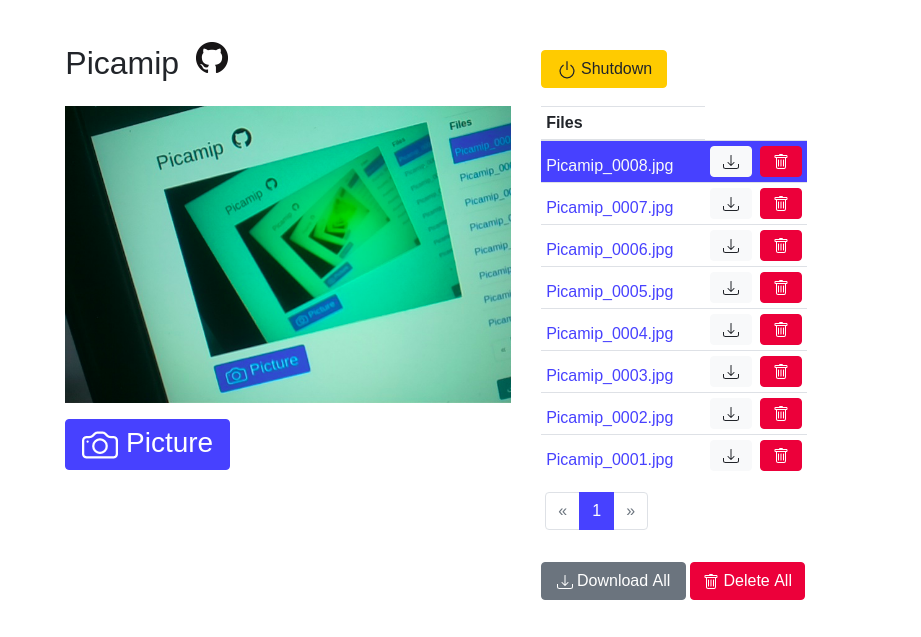

# PICAMIP 
> Raspberry Pi Camera Web Interface

This software runs on a RPi, it starts a webserver accessible via it's
IP address. The web interface has a preview screen, buttons to take 
picture, download and delete images.



# Installing 
Install with pip
```
pip install picamip
```

# Running
The software can be started with
```
$ picamip
```
Then go to the interface at http://<Raspberry IP address>:8000

Additional options may be passed to the program:
```
picamip --help
usage: picamip [-h] [-p PICTURE_DIR] [-f FILES_PREFIX] [-t FLASK_TEMPLATE]
               [-s FLASK_STATIC] [-d DEFAULT_ROUTE] [-v]
               [host] [port]

picamip: Raspberry Pi IP Camera

positional arguments:
  host                  Server host
  port                  Server port

optional arguments:
  -h, --help            show this help message and exit
  -p PICTURE_DIR, --picture-dir PICTURE_DIR
                        Pictures storage directory
  -f FILES_PREFIX, --files-prefix FILES_PREFIX
                        Directory to store the pictures. Default: ~/Pictures
  -t FLASK_TEMPLATE, --flask-template FLASK_TEMPLATE
                        Flask additional jinja2 templates directory
  -s FLASK_STATIC, --flask-static FLASK_STATIC
                        Flask additional static files directory
  -d DEFAULT_ROUTE, --default-route DEFAULT_ROUTE
                        Default root route. Eg: index.html
  -v, --version         show program's version number and exit
```

# License
> Python simple Raspberry-Pi camera module web interface
> Copyright (c) 2020 Luiz Eduardo Amaral <luizamaral306@gmail.com>
> 
> Redistribution and use in source and binary forms, with or without
> modification, are permitted provided that the following conditions are met:
> 
>     * Redistributions of source code must retain the above copyright
>       notice, this list of conditions and the following disclaimer.
>     * Redistributions in binary form must reproduce the above copyright
>       notice, this list of conditions and the following disclaimer in the
>       documentation and/or other materials provided with the distribution.
>     * Neither the name of the copyright holder nor the
>       names of its contributors may be used to endorse or promote products
>       derived from this software without specific prior written permission.
> 
> THIS SOFTWARE IS PROVIDED BY THE COPYRIGHT HOLDERS AND CONTRIBUTORS "AS IS"
> AND ANY EXPRESS OR IMPLIED WARRANTIES, INCLUDING, BUT NOT LIMITED TO, THE
> IMPLIED WARRANTIES OF MERCHANTABILITY AND FITNESS FOR A PARTICULAR PURPOSE
> ARE DISCLAIMED. IN NO EVENT SHALL THE COPYRIGHT HOLDER OR CONTRIBUTORS BE
> LIABLE FOR ANY DIRECT, INDIRECT, INCIDENTAL, SPECIAL, EXEMPLARY, OR
> CONSEQUENTIAL DAMAGES (INCLUDING, BUT NOT LIMITED TO, PROCUREMENT OF
> SUBSTITUTE GOODS OR SERVICES; LOSS OF USE, DATA, OR PROFITS; OR BUSINESS
> INTERRUPTION) HOWEVER CAUSED AND ON ANY THEORY OF LIABILITY, WHETHER IN
> CONTRACT, STRICT LIABILITY, OR TORT (INCLUDING NEGLIGENCE OR OTHERWISE)
> ARISING IN ANY WAY OUT OF THE USE OF THIS SOFTWARE, EVEN IF ADVISED OF THE
> POSSIBILITY OF SUCH DAMAGE.
